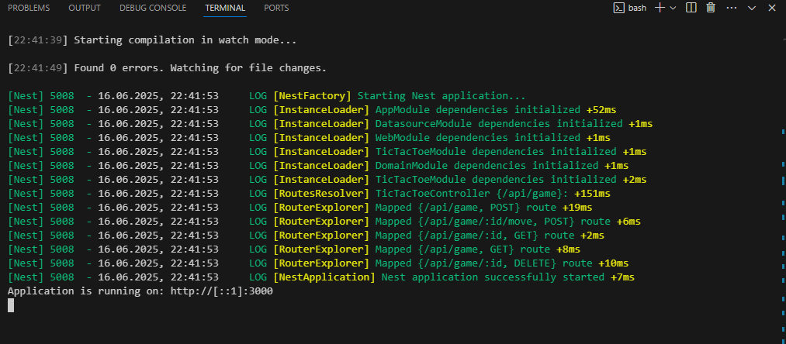
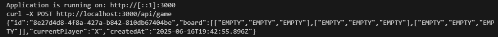
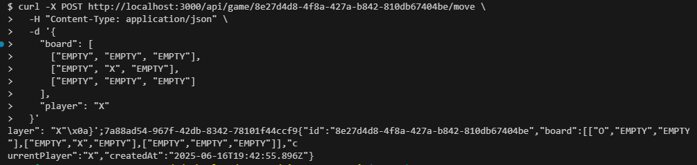
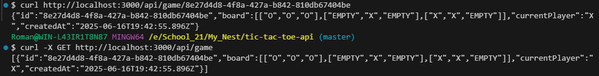
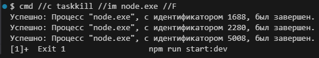

# tic-tac-toe-api (сервер для игры крестики-нолики)
Описание: 
В данном проекте представлена реализация веб-приложения для игры в крестики-нолики на языке typeScript c использованием среды Node.js и фреймворка Nest.js. 
Архитектура сервиса включает следующие слои:
  - datasource-слой; 
  - domain-слой; 
  - web-слой. 
datasource-слой содержит хранилище для сохранения и получения игр; domain-слой содержит бизнес-логику игры. Данная служба RESTfull - контроллер web-слоя имеет методы Post для создания игры и осуществления следующего хода, методы Get для получения текущей игры и списка всех сохраненных игр, метод Delete для ручного удаления игры по id игры. 
Следующий ход игры рассчитывается алгоримом Minimax - это решающий алгоритм, применяемый в теории игр и искусственном интеллекте для определения оптимального хода в играх с альтернативными ходами двух игроков (один из них стремится минимизировать результат, а другой максимизировать). Он используется для принятия решений в условиях неопределенности. 
Также реализовано автоматическое удаление игр по истечении периода времени 24 часа. 

Для осуществления запросов и ответов можно использовать Postman, Insomnia, Swagger.
Для запуска веб-приложения через консоль необходимо: 
  - создать у себя на компьютере проект командой nest new tic-tac-toe-api; 
  - скопировать в созданный проект папки и файлы из текущего репозитория; 
  - запустить веб-приложение в фоновом режиме (это позволит продолжать пользоваться консолью) командой npm run start:dev & ; 
  - создать игру: curl -X POST http://localhost:3000/api/game; 
  - осуществить ход в игре: curl -X POST http://localhost:3000/api/game/put-here-id-current-game/move \ 
      -H "Content-Type: application/json" \ 
      -d '{ 
        "board": [ 
          ["EMPTY", "EMPTY", "EMPTY"], 
          ["EMPTY", "X", "EMPTY"], 
          ["EMPTY", "EMPTY", "EMPTY"] 
        ], 
        "player": "X" 
      }' 
    ; 
    ВНИМАНИЕ: id для REST запросов (строка put-here-id-current-game) брать из id игры, созданной на первом шаге. 
    Исходя из ответов aiИгрока, продолжать делать ходы до завершения игры (победа, поражение, ничья); 
  - получить список сохраненных игр: curl -X GET http://localhost:3000/api/game ; 
  - удалить завершенную игру: curl -X DELETE http://localhost:3000/api/game/put-here-id-current-game; 
  - убить все NODE процессы для остановки веб-приложения: cmd //c taskkill //im node.exe //F 

**Запуск веб-приложения:** 
 
**Создание игры:** 
 
**Осуществление хода игроком и ответный ход aiИгрока:** 
 
**Получение текущей игры:** 
 
**Удаление текущей игры:** 
 
**Закрытие веб-приложения:** 
 